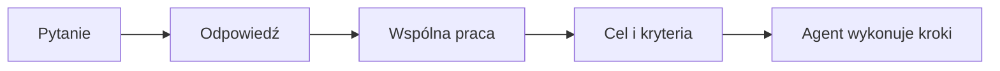

# Odnaleźć się w dobie AI

Scenariusz otwierającej prezentacji na pierwszym meetupie bielsko.ai.

**Cel:** oswoić skalę zmiany bez pompowania FOMO, pokazać, że AI nie jest wyłącznie tematem dla programistów, oraz zaprosić uczestników do wspólnego, praktycznego uczenia się.

**Proponowany czas:** 30-35 minut + 5 minut na zakończenie i przejście do kolejnego punktu programu.

**Ton:** ciekawy, spokojny, konkretny. Mniej: "musisz nadążyć". Więcej: "to dobry moment, żeby zacząć razem".

---

## Akt I - Dlaczego tu jesteśmy (ok. 5 min)

### 1. Tytuł

**Na slajdzie**

> **Odnaleźć się w dobie AI**
>
> bielsko.ai - pierwsza edycja

**Powiedz**

"AI potrafi dziś jednocześnie ekscytować, męczyć i trochę niepokoić. Nie przyszliśmy tu obiecywać, że za godzinę wszyscy będziemy ekspertami. Chcemy złapać wspólny punkt odniesienia: gdzie naprawdę jesteśmy, co się zmienia i jak można wejść w ten świat po swojemu."

**Wizualnie:** zdjęcie Bielska-Białej lub publiczności, lekki motyw sieci/połączeń. Bez futurystycznego "tech bro" klimatu.

---

### 2. Dlaczego powstało bielsko.ai

**Na slajdzie**

> AI nie jest tylko dla programistów.
>
> Jest dla ludzi, którzy chcą lepiej pracować, tworzyć, uczyć się i podejmować decyzje.

**Powiedz**

"bielsko.ai powstało, bo rozmowa o AI bardzo łatwo zamyka się w bańce technologicznej. A przecież narzędzia AI wchodzą do biznesu, edukacji, projektowania, marketingu, nauki i codziennego życia. Chcemy zbudować w Bielsku miejsce, gdzie można je rozumieć i testować - bez udawania, że trzeba od razu znać wszystkie modele."

**Wizualnie:** cztery proste obszary: praca, biznes, nauka, twórczość.

---

### 3. Czym będzie ten meetup

**Na slajdzie**

| Będzie | Nie będzie |
| --- | --- |
| miejscem do testowania i zadawania pytań | wyścigiem na najbardziej techniczny żargon |
| praktycznymi przykładami | kultem jednego narzędzia lub firmy |
| rozmową ludzi z różnych branż | wydarzeniem tylko dla programistów |
| przestrzenią do pokazywania projektów i błędów | presją, że trzeba "nadążyć" |

**Powiedz**

"Najciekawsze rzeczy dzieją się, gdy spotykają się różne perspektywy. Ktoś wie, jak działa produkt, ktoś rozumie klientów, ktoś umie projektować, ktoś programować, a ktoś po prostu ma bardzo dobry problem do rozwiązania."

---

### 4. To dopiero początek

**Na slajdzie**

```text
Dzisiaj                 lipiec / sierpień                 wrzesień
Pierwsza edycja    ->   Cursor Cafe                  ->    Kolejny meetup
```

**Podpis:** daty i formaty do potwierdzenia.

**Powiedz**

"Dzisiejsze spotkanie jest pierwszym krokiem. Między lipcem a sierpniem chcemy spotkać się w luźniejszej formule Cursor Cafe - z laptopami, rozmowami i wspólnym budowaniem. We wrześniu wracamy z kolejną pełną edycją."

**Wizualnie:** prosta, rosnąca oś czasu. Bez przeładowania szczegółami.

---

## Akt II - Co właściwie się przyspieszyło? (ok. 8 min)

### 5. Nie chodzi już tylko o czat

**Na slajdzie**

> 2023: **zadaj pytanie**
>
> 2024: **pracuj ze mną**
>
> 2025/2026: **oto cel - zaplanuj i wykonaj zadanie**

**Powiedz**

"Największa zmiana nie polega na tym, że odpowiedzi są trochę lepsze. Zmienia się interfejs pracy. Z pojedynczego pytania przechodzimy do współpracy nad dokumentem, projektem, analizą, kodem czy procesem. A w części zastosowań - do delegowania dobrze określonego celu."

**Wizualnie:** trzy ekrany obok siebie: chat, współdzielony dokument/edytor, agent z listą wykonanych kroków.

---

### 6. 18 miesięcy, które zmieniły oczekiwania

**Na slajdzie**

| Obszar | Koniec 2024 | Połowa 2026 |
| --- | --- | --- |
| Tekst i reasoning | GPT-4o, Claude 3.5 Sonnet, Gemini 1.5 Pro | modele rozumujące i agentowe, mocniejsze w dłuższych zadaniach |
| Kod | autocomplete, chat w IDE, pierwsze agentowe workflow | agent w repozytorium, planowanie zmian, testy i iteracja |
| Obraz | generowanie pojedynczego obrazu, podstawowa edycja | lepsza kontrola, spójność, edycja i multimodalne workflow |
| Wideo | krótkie, efektowne demonstracje | bardziej użyteczne ujęcia, dłuższe klipy, audio i postprodukcja |
| Głos | transkrypcja i synteza | rozmowa w czasie rzeczywistym, tłumaczenie, audio jako interfejs |

**Powiedz**

"To nie jest ranking marek. To porównanie oczekiwań. Jeszcze niedawno wiele z tych rzeczy było ciekawą demówką. Dziś można na nich realnie oprzeć fragment pracy. Nadal nie każdy fragment i nadal z koniecznością weryfikacji - ale próg użyteczności mocno się przesunął."

**Wizualnie:** dwa pionowe słupki czasu, po lewej 2024, po prawej 2026. Użyj logo modeli tylko jako drobnych przykładów, nie jako głównej treści.

---

### 7. Od odpowiedzi do działania

**Na slajdzie**



**Powiedz**

"Agent nie jest magicznym pracownikiem, któremu można bezmyślnie oddać firmę. To model, który w pętli potrafi rozłożyć cel na kroki, użyć narzędzi, sprawdzić wynik i spróbować ponownie. Najlepiej działa tam, gdzie cel, dane wejściowe i definicja sukcesu są konkretne."

**Dobre przykłady:** przygotowanie researchu do briefu, porównanie ofert, wstępna analiza danych, zmiana w kodzie wraz z testami, przygotowanie wariantów komunikacji.

---

### 8. Jak długo agent potrafi "pracować sam"?

**Na slajdzie**

> **Około 2 h 17 min**
>
> to aktualny przykład 50% "time horizon" dla agenta GPT-5
>
> w benchmarku dobrze określonych zadań technicznych

**Dopisek małym tekstem:** To nie jest czas pracy agenta na zegarze ani obietnica, że wykona każde 2-godzinne zadanie.

**Powiedz**

"METR mierzy trudność zadania przez czas, którego potrzebowałby doświadczony człowiek bez kontekstu projektu. Dla przykładu: GPT-5 osiąga w tym badaniu 50% szans powodzenia przy zadaniu, które człowiek wykonałby średnio w około 2 godziny i 17 minut. To ważny sygnał progresu, ale nie wolno go czytać jako: 'AI samodzielnie zastępuje pracownika na dwie godziny'. Badane zadania są głównie techniczne, dobrze określone i łatwe do automatycznej oceny."

**Wizualnie:** prosty wykres horyzontu METR lub własny, bardzo czytelny pasek z jasnym opisem metodologii.

---

### 9. Najważniejsza umiejętność: dobrze oddać stery

**Na slajdzie**

> Dobry cel + kontekst + kryteria sukcesu + weryfikacja
>
> = znacznie lepszy efekt niż "zrób mi coś fajnego"

**Powiedz**

"W świecie agentów rośnie znaczenie umiejętności, które nie są czysto techniczne: definiowania problemu, podawania kontekstu, oceny jakości i podejmowania odpowiedzialności za decyzję. To kompetencje przydatne nie tylko programistom."

**Wizualnie:** karta z czterema polami: cel, kontekst, ograniczenia, definicja gotowego wyniku.

---

## Akt III - Jesteśmy wcześnie, nie za późno (ok. 7 min)

### 10. Dwie prawdziwe rzeczy naraz

**Na slajdzie**

> AI rośnie szybciej niż poprzednie technologie.
>
> **I jednocześnie większość ludzi oraz firm wciąż używa jej powierzchownie albo wcale.**

**Powiedz**

"To jest antidotum na FOMO. Osiągnięcia modeli są szybkie, premiery są głośne i codziennie pojawiają się nowe narzędzia. Ale między 'słyszałem o AI' a 'umiem świadomie wykorzystać AI w swoim kontekście' jest nadal ogromna przestrzeń."

---

### 11. Adopcja: duża, ale bardzo nierówna

**Na slajdzie**

| Co mierzymy | Wynik | Jak to czytać |
| --- | ---: | --- |
| Użycie GenAI na świecie przez osoby 15-64 | 17,8% | globalna miara aktywnego użycia produktu GenAI w I kw. 2026 |
| Użycie GenAI w populacji - szacunek Stanford AI Index | 53% | szeroka miara adopcji populacyjnej, różna między krajami |
| Pracownicy USA: AI robi choć część ich pracy | 21% | nadal 65% mówi, że w pracy używa AI mało albo wcale |
| Firmy strefy euro używające AI intensywnie | 7% | technologia jest już obecna, ale głębokie użycie pozostaje rzadkie |

**Powiedz**

"Nie istnieje jeden idealny procent adopcji, bo badania mierzą różne rzeczy: korzystanie z produktu, kontakt z funkcją AI, użycie w pracy albo intensywność wdrożenia. Zamiast udawać precyzję, zobaczmy wzorzec: AI jest wszędzie w rozmowie, szybko rośnie w użyciu, ale świadome i głębokie wykorzystanie jest wciąż dużo rzadsze."

**Wizualnie:** cztery kafelki liczbowe z opisem, nie jeden wykres udający, że dane są identyczne metodologicznie.

---

### 12. To nie jest problem "braku talentu"

**Na slajdzie**

> Bariery wejścia są zwykle prozaiczne:
>
> - nie wiem, od czego zacząć
> - nie mam bezpiecznego miejsca na eksperyment
> - nie wiem, co warto sprawdzać
> - nie chcę wyjść na osobę, która "nie ogarnia"

**Powiedz**

"To właśnie jest przestrzeń dla community. Czasem potrzebujesz nie kursu za kilka tysięcy złotych, tylko pięciu ludzi przy stole, którzy powiedzą: 'pokaż, co próbujesz zrobić, zobaczmy'."

---

## Akt IV - Dlaczego ta zmiana tak porusza (ok. 8 min)

### 13. Czwarta rewolucja odśrodkowienia

**Na slajdzie**

| Rewolucja | Co przestało być oczywiste | Co zyskaliśmy |
| --- | --- | --- |
| Kopernik | Ziemia nie jest centrum kosmosu | lepsze rozumienie świata i metoda naukowa |
| Darwin | Człowiek nie stoi poza naturą | głębsze rozumienie życia i naszego miejsca w nim |
| Freud | Świadomość nie rządzi w pełni naszym umysłem | narzędzia do lepszego rozumienia siebie |
| AI | złożone poznanie nie jest wyłącznie ludzką własnością | nowe sposoby tworzenia, odkrywania i współpracy |

**Powiedz**

"W artykule Cambria i współautorów AI jest opisana jako czwarta rewolucja odśrodkowienia. To celowo duża rama: nie chodzi wyłącznie o nowe oprogramowanie, lecz o to, jak myślimy o ludzkiej wyjątkowości. Każda z wcześniejszych zmian na początku odbierała poczucie centralności, a potem poszerzała nasze możliwości poznania."

**Wizualnie:** cztery równe kolumny - ostatnia wyraźnie współczesna, ale nie katastroficzna.

---

### 14. Cztery przesunięcia - pozytywny odczyt

**Na slajdzie**

> Nie jesteśmy mniejsi, kiedy przestajemy być centrum.
>
> **Stajemy się bardziej zdolni do rozumienia i współpracy.**

**Powiedz**

"Kopernik nauczył nas pokory wobec wszechświata. Darwin - ciągłości z życiem. Freud - że samowiedza wymaga pracy. AI może nauczyć nas jeszcze jednej rzeczy: wartość człowieka nie polega wyłącznie na tym, że potrafi szybciej obliczać, pamiętać albo składać zdania. Polega też na odpowiedzialności, relacjach, intencji i wyborze, do czego użyjemy nowych możliwości."

**Uwaga merytoryczna:** unikaj stwierdzenia, że AI ma świadomość. Slajd mówi o funkcjonalnych zdolnościach poznawczych, nie o naturze umysłu.

---

### 15. Skąd bierze się opór i hejt?

**Na slajdzie**

> Gdy narzędzie dotyka pracy, autorstwa i statusu,
> reakcja rzadko jest wyłącznie o samym narzędziu.

**Trzy napięcia:**

1. "Czy moja praca nadal ma wartość?"
2. "Czy to jeszcze jest moje dzieło?"
3. "Kto zyskuje kontrolę, a kto ją traci?"

**Powiedz**

"Jeśli artysta korzysta z AI i spotyka się z ostrą reakcją, debata zazwyczaj nie dotyczy tylko jednego obrazu czy utworu. Jest w niej lęk o uczciwość, utrzymanie, autorstwo i jakość kultury. Nie musimy ignorować tych pytań, żeby zachować ciekawość wobec technologii. Dojrzała postawa to jednocześnie eksperymentować i pytać o zasady."

---

### 16. Nie chodzi o człowiek kontra AI

**Na slajdzie**

> Najciekawsze pytanie brzmi:
>
> **co człowiek z AI może zrobić lepiej, odpowiedzialniej i ciekawiej niż każde z nich osobno?**

**Powiedz**

"Artykuł nie postuluje kapitulacji człowieka. Przeciwnie - proponuje przejście od rywalizacji do komplementarności. To oznacza potrzebę krytycznego myślenia, edukacji, odpowiedzialności i bardzo ludzkiej umiejętności oceniania konsekwencji."

---

## Akt V - Praca i twórczość po tanim kodzie (ok. 4 min)

### 17. Code is cheap

**Na slajdzie**

> Kod staje się tańszy.
>
> **Rozumienie problemu nie.**

**Powiedz**

"Dla programistów to nie jest komunikat: 'kod już nie ma znaczenia'. To komunikat: jego koszt produkcji spada. Wartość przesuwa się w stronę dobrego problemu, architektury, danych, bezpieczeństwa, decyzji produktowych, integracji z rzeczywistością i odpowiedzialności za efekt."

**Wizualnie:** lewa strona - szybkie generowanie kodu; prawa - rosnące znaczenie: problem, produkt, system, weryfikacja.

---

### 18. Ta zmiana dotyczy nie tylko kodu

**Na slajdzie**

| Zawód / obszar | "Tani" staje się | Cenniejsze staje się |
| --- | --- | --- |
| marketing | pierwsza wersja copy i warianty | strategia, marka, rozumienie odbiorcy |
| design | szybkie eksploracje wizualne | taste, system, doświadczenie użytkownika |
| analiza | pierwsza synteza danych | właściwe pytania, metodologia, decyzja |
| edukacja | pierwsza odpowiedź i ćwiczenia | nauka myślenia, feedback, relacja |
| programowanie | szkic implementacji | kontekst systemu, jakość, bezpieczeństwo |

**Powiedz**

"W wielu branżach pierwszy draft będzie coraz łatwiejszy. To nie obniża znaczenia ludzi - zmienia miejsce, w którym powstaje największa wartość."

---

## Akt VI - Mniej FOMO, więcej ciekawości (ok. 4 min)

### 19. AI fatigue jest normalne

**Na slajdzie**

> Nowy model. Nowy benchmark. Nowy agent. Nowy tool.
>
> **Nie musisz być na bleeding edge, żeby zacząć korzystać z AI dobrze.**

**Powiedz**

"Można być zmęczonym tempem premier. To zdrowa reakcja, nie osobista porażka. Nikt nie ma obowiązku testować wszystkiego. Ważniejsze od śledzenia każdej nowości jest znalezienie jednego lub dwóch problemów, w których AI naprawdę pomaga."

---

### 20. Mały, zdrowy plan wejścia

**Na slajdzie**

1. Wybierz jeden powtarzalny problem z własnej pracy lub życia.
2. Przetestuj jedno narzędzie przez tydzień.
3. Zapisz, co zadziałało, a co nie.
4. Pokaż wynik komuś i porównaj doświadczenia.
5. Ucz się dalej tylko wtedy, gdy widzisz wartość.

**Powiedz**

"Nie zaczynaj od listy stu narzędzi. Zacznij od własnego problemu. To może być przygotowanie spotkania, porządkowanie informacji, nauka języka, analiza ankiety, plan podróży, prototyp pomysłu albo pierwsza automatyzacja."

---

### 21. Po to jest bielsko.ai

**Na slajdzie**

> Ciekawość zamiast presji.
>
> Praktyka zamiast teorii bez końca.
>
> Ludzie zamiast samotnego przekopywania się przez hype.

**Powiedz**

"Chcemy, żeby bielsko.ai było miejscem, w którym można przyjść z pytaniem, pomysłem, wątpliwością albo projektem. Można pokazać coś niedokończonego. Można nie wiedzieć. I można po prostu dobrze się bawić, ucząc się nowych rzeczy."

---

### 22. Zakończenie i wezwanie do działania

**Na slajdzie**

> Nie musisz przewidzieć całej przyszłości.
>
> Wystarczy, że zrobisz następny sensowny krok.
>
> **Zróbmy go razem.**

**Powiedz**

"Dziękujemy, że jesteście na pierwszej edycji. Porozmawiajcie dziś z kimś, kogo jeszcze nie znacie. Zapytajcie, co próbuje zrobić z AI, albo pokażcie własny problem. Być może właśnie z takiej rozmowy powstanie coś, czego żaden model nie wygeneruje za nas."

**Opcjonalny dopisek:** QR do Discorda, strony `bielsko.ai` i zapowiedzi Cursor Cafe.

---

## Appendix - źródła do cytowania w prezentacji

Poniższe źródła warto umieścić małym tekstem na odpowiednich slajdach, a pełne linki zachować w ostatnim slajdzie lub w opisie wydarzenia.

| Temat | Źródło | Zastosowanie |
| --- | --- | --- |
| Czwarta rewolucja odśrodkowienia | Cambria et al., *Artificial Intelligence as the Fourth Decentering Revolution* (2026), https://doi.org/10.1007/s12559-026-10569-8 | Slajdy 13-16. Rama filozoficzna, nie dowód na świadomość AI. |
| Horyzont wykonywania zadań przez agentów | METR, *Task-Completion Time Horizons of Frontier AI Models*, aktualizacja 8 maja 2026, https://metr.org/time-horizons/ | Slajd 8. Koniecznie wraz z ograniczeniami metodologii. |
| Globalne użycie GenAI | Microsoft, *The state of global AI diffusion in 2026*, 7 maja 2026, https://blogs.microsoft.com/on-the-issues/2026/05/07/the-state-of-global-ai-diffusion-in-2026/ | Slajd 11. 17,8% osób 15-64 w I kw. 2026 według ich metodologii telemetrycznej. |
| Tempo szerokiej adopcji | Stanford HAI, *AI Index Report 2026*, https://hai.stanford.edu/ai-index/2026-ai-index-report | Slajd 11. 53% populacyjnej adopcji GenAI w użytej przez raport miarze. |
| Użycie i postawy w pracy | Pew Research Center, *What the data says about Americans' views of artificial intelligence*, 12 marca 2026, https://www.pewresearch.org/short-reads/2026/03/12/key-findings-about-how-americans-view-artificial-intelligence/ | Slajd 11 oraz 15. 21% pracowników deklaruje, że AI wykonuje część ich pracy; 65% używa jej w pracy mało albo wcale. |
| Intensywne wdrożenia firmowe | European Central Bank, *What separates firms that use AI intensively from firms that don't?*, 24 czerwca 2026, https://www.ecb.europa.eu/press/blog/date/2026/html/ecb.blog20260624~44f70da110.en.html | Slajd 11. Tylko 7% firm strefy euro zgłasza intensywne użycie AI. |

## Checklist przed wystąpieniem

- [ ] Potwierdzić datę i format Cursor Cafe oraz wrześniowego meetupu.
- [ ] Zaktualizować slajd 6 o faktycznie wybrane przykłady modeli używane podczas wydarzenia.
- [ ] Przygotować jeden konkretny przykład "pytanie -> wspólna praca -> agent" z bliskiego uczestnikom kontekstu.
- [ ] Nie pokazywać wartości 2 h 17 min bez dopisku o 50% skuteczności i technicznym charakterze benchmarku.
- [ ] Na slajdzie ze statystykami zostawić źródła i definicje miar - nie mieszać ich jak jednego procentu adopcji.
- [ ] Dodać QR do Discorda i strony bielsko.ai na ostatnim slajdzie.
