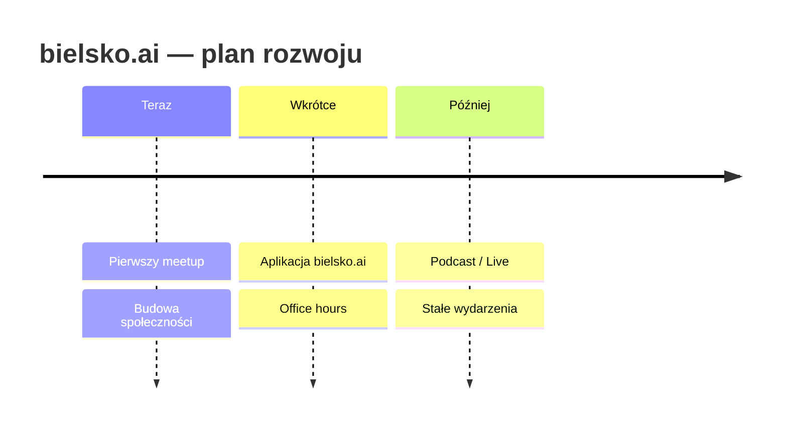

# bielsko.ai

Spotkanie społeczności AI w Bielsku-Białej

  AI zmieni nasze życie i naszą rolę — bawmy się tym do woła 🚀

  Naciśnij spację, aby przejść dalej <carbon:arrow-right />

<!--
Slajd tytułowy. TODO: dopracować branding bielsko.ai, logo, kolory.
-->

---
layout: section
---

# 1. Intro

<!--
Sekcja wprowadzająca. -->

---
layout: center
class: text-center
---

# Kto jest kim? 🙋

Zacznijmy od pytania — podnieście rękę jeśli...

<v-clicks>

- ...piszecie kod na co dzień
- ...używacie AI w pracy
- ...jesteście tu pierwszy raz
- ...prowadzicie własny biznes

</v-clicks>

<!--
Interaktywny start — podnoszenie ręki. Rozgrzewka sali, poznanie publiczności.
TODO: dobrać finalny zestaw pytań.
-->

---

# Czym będzie bielsko.ai? (1/2)

  Placeholder — szybki slajd o wizji społeczności.

<v-clicks>

- Lokalna społeczność wokół AI
- Miejsce do nauki i wymiany doświadczeń
- Dla wszystkich — nie tylko dla developerów

</v-clicks>

<!--
TODO: doprecyzować wizję i misję bielsko.ai.
-->

---

# Czym będzie bielsko.ai? (2/2)

  Placeholder — drugi slajd o wizji.

<v-clicks>

- Regularne spotkania (meetupy)
- Praktyczne demo i warsztaty
- Networking lokalnej sceny tech

</v-clicks>

<!--
TODO: dokończyć drugi slajd "czym będzie bielsko.ai".
-->

---

# Roadmap 🗺️

  Placeholder roadmapy — do uzupełnienia konkretnymi datami i kamieniami milowymi.

<!--
TODO: uzupełnić roadmap konkretami (daty, kamienie milowe).
-->

---
layout: image-right
image: https://cover.sli.dev
---

# Aplikacja bielsko.ai 📱

  Placeholder — prezentacja aplikacji bielsko.ai.

<v-clicks>

- Do czego służy
- Kluczowe funkcje
- Jak dołączyć / pobrać

</v-clicks>

<!--
TODO: zrzuty ekranu / demo aplikacji bielsko.ai.
-->

---

# Story behind 📖

  Placeholder — historia powstania bielsko.ai.

<v-clicks>

- Skąd pomysł
- Kto stoi za inicjatywą
- Dlaczego teraz

</v-clicks>

<!--
TODO: opowieść o genezie projektu.
-->

---
layout: two-cols
layoutClass: gap-12
---

# Office hours 🕐

  Placeholder — otwarte godziny konsultacji.

<v-clicks>

- Kiedy i gdzie
- Dla kogo
- Jak się zapisać

</v-clicks>

::right::

# Podcast / Live 🎙️

  Placeholder — podcast i transmisje na żywo.

<v-clicks>

- Format
- Tematyka
- Gdzie słuchać / oglądać

</v-clicks>

<!--
TODO: szczegóły office hours oraz podcast / live.
-->

---
layout: section
class: text-center
---

# 2. Nova Patria

Przerywnik sponsora miejsca ☕

  Placeholder — slajd sponsorski / podziękowanie dla Nova Patria.

<!--
TODO: branding Nova Patria, logo, podziękowania, info o miejscu.
-->

---
layout: section
---

# 3. Prezentacja by bielsko.ai team

  Morał: nie pytanie–odpowiedź, ale <b>znaczące zadanie</b>.

<!--
Główna część merytoryczna prezentacji zespołu.
-->

---
layout: center
class: text-center
---

# AI in one minute ⏱️

  Placeholder — AI wytłumaczone w jedną minutę.

<!--
TODO: super zwięzłe, przystępne wyjaśnienie czym jest AI.
-->

---

# Historia modelowa — ostatnie 1,5 roku 📈

  Jak szybko zmieniały się modele.

<v-clicks>

- 🧥 Przykład: **outfit** — generowanie / dopasowanie ubioru
- ⌨️ Przykład: **klawiatury**
- 🎨🔊 Przykłady modeli **wizualnych i dźwiękowych**

</v-clicks>

  Placeholder — do każdej pozycji dodać konkretne demo / obraz / próbkę audio.

<!--
TODO: zebrać materiały (outfit, klawiatury, modele wizualne i dźwiękowe).
-->

---

# Hermes — fun examples z Ari 🤖

Asystent **niekodowy** — AI w codziennych zadaniach.

<v-clicks>

- ☕ Sprawdzanie cen kawiarnianych w okolicy dla własnego biznesu (In progress)
- 🎬 Wyręczanie w tedious rzeczach — zamawianie biletów do kina (In progress)
- 🗂️ Zarządzanie bielsko.ai (management)

</v-clicks>

<!--
TODO: nagrać / przygotować demo Hermes + Ari dla każdego z przykładów.
Dwa pierwsze oznaczone jako In progress w planie.
-->

---
layout: statement
---

# Nie pytanie → odpowiedź

## Tylko **znaczące zadanie** ✅

  Placeholder — clou przekazu: AI jako wykonawca zadań, nie wyszukiwarka.

<!--
TODO: rozwinąć myśl — przejście od chatbota do agenta wykonującego zadania.
-->

---

# Statystyki — adopcja AI 📊

> Dario mówił, że **90% kodu** będzie generowane — nikt nie wierzył.

### Adopcja w firmach
Placeholder — dane o wdrożeniach AI w organizacjach.

### Odbiór poza światem IT
Placeholder — jak AI jest odbierane poza branżą.

<!--
TODO: znaleźć i wstawić konkretne statystyki + źródła.
-->

---
layout: center
class: text-center
---

# Code is cheap 💸

  Everyone can code.

  Placeholder — transition to <b>wylon</b>.

<!--
TODO: rozwinąć "code is cheap" i przejście do wylon.
-->

---
layout: image-right
image: https://cover.sli.dev
---

# Remote control 📲

Prompt z telefonu, podczas gdy delektujesz się kawą w Nova Patria ☕

  Placeholder — demo sterowania AI zdalnie z telefonu.

<!--
TODO: demo "prompt on phone" — sterowanie agentem zdalnie.
-->

---
layout: center
class: text-center
---

# AI Fatigue 😮‍💨

  It's cool — <b>nie musisz być na bleeding edge</b>.
  Możesz cieszyć się procesem, ucząc się po trochu —
  albo dołączając do naszego meetupu :)

<!--
TODO: uspokajający ton — zmęczenie AI jest ok, learning by little.
-->

---
layout: end
class: text-center
---

# Bawmy się tym! 🎉

  AI zmieni nasze życie i naszą rolę —
  więc cieszmy się tym do woła i miejmy frajdę.

  Dziękujemy! · bielsko.ai

<!--
Slajd zamykający. Pozytywna pointa z planu.
-->
